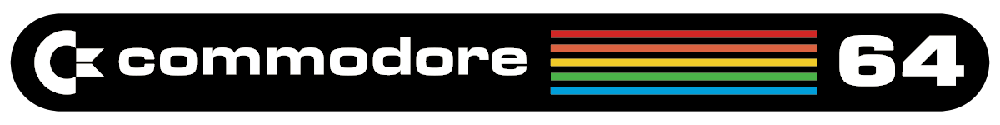
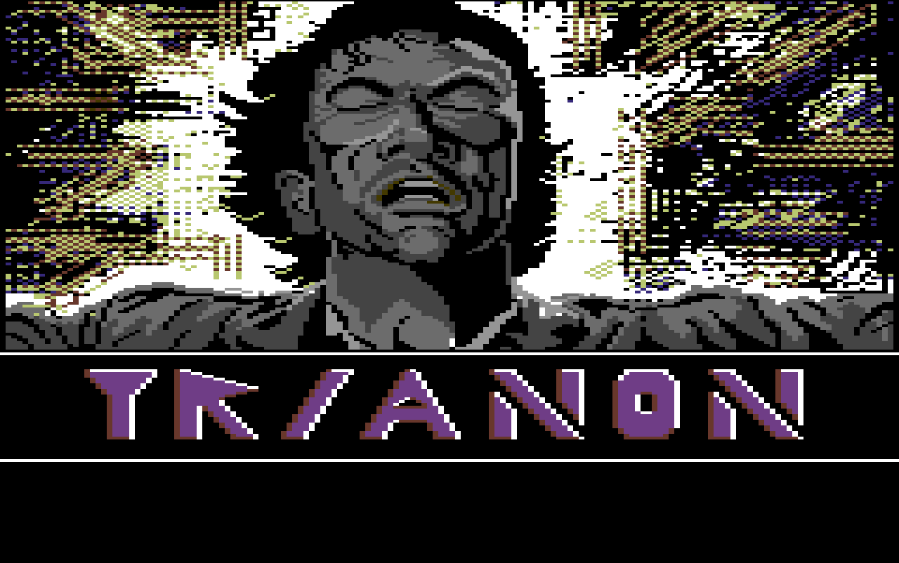

<div align="center" width="100%" >
  
</div>

# *`MetallC64`*

A <a href="https://en.wikipedia.org/wiki/Commodore_64">Commodore 64</a> emulator written in C.<br>

## about the Commodore 64  
The **Commodore 64 (C64)** is one of the most iconic home computers of all time. Released in **1982**, it became the **best-selling computer** ever, due to its powerful hardware, affordability, and massive software library. It featured:
```
- 6510 CPU, a modified version of the 6502.  
- VIC-II (Video Interface Chip) for graphics and sprites.  
- 6581 SID (Sound Interface Device) for advanced sound synthesis.  
- Two 6526 CIA (Complex Interface Adapters) for I/O operations.
```

The C64 was popular for **gaming, programming, and productivity**, with thousands of titles released for it.  

## about this emulator  
MetallC64 is a work-in-progress C64 emulator that aims to run **BASIC programs and games**. However, it is **not cycle-accurate** and **not highly precise**, meaning some programs **may not work as expected or as in real hardware**.  

### current limitations:  
- **VIC-II (Graphics) is not fully accurate** and may have **visual glitches**.  
- **SID (Sound) is not implemented yet**.  
- Some **hardware features are missing or incomplete**.

### main components implemented:  
- **<a href="https://github.com/beddinao/MOS-6502-Emulator">6510 CPU</a>**` (instruction accurate independant emulator)`
- **VIC-II** `(Partial sprite emulation)`
- **CIA-1 & CIA-2** `(Basic support for keyboard and timers)`

## shell interface  
The emulator includes a **command shell** running on a separate thread, allowing users to interact with the emulator.  

### available commands:  

| **command**  | **description** |
|----------------|---------------|
| `LDP [path]` | Load a BASIC program (`.prg`) into memory. |
| `LDD [path]` | Load a (`.d64`) D64 disk image. |
|-|-|
| `BRD [1-16]` | Change the border color. |
| `BGR [1-16]` | Change the background color. |
| `TXT [1-16]` | Change the text color. |
|-|-|
| `DMP $st $en` | Dump memory from address `$st` to `$en` in the range `0-FFFF`. |
| `SCR` | Show CPU status. |
| `SVR` | Show VIC-II status. |
| `SC1` | Show CIA#1 status. |
| `SC2` | Show CIA#2 status. |
|-|-|
| `CLR` | Clear the loaded program from memory **and perform a hard reset**. |
| `EXT` | Exit the emulator. |

## graphics library:
MetallC64 uses <a href="https://github.com/codam-coding-college/MLX42">MLX42</a>, a lightweight graphics library based on GLFW. This allows for simple rendering of the Commodore 64 display.

## screenshots
<div align="center" width="100%">
  
  
  
  
  
  
  
  
  
</div>


## system requirements
- **`Linux or Macos`**
- **`glfw (libglfw3-dev)`**
- **`readline (libreadline-dev)`**
- **`cmake >= 3.18`**

## **upcoming features:**  
- **Full hardware sprite support** (partial-progress)  
- **SID sound emulation**
